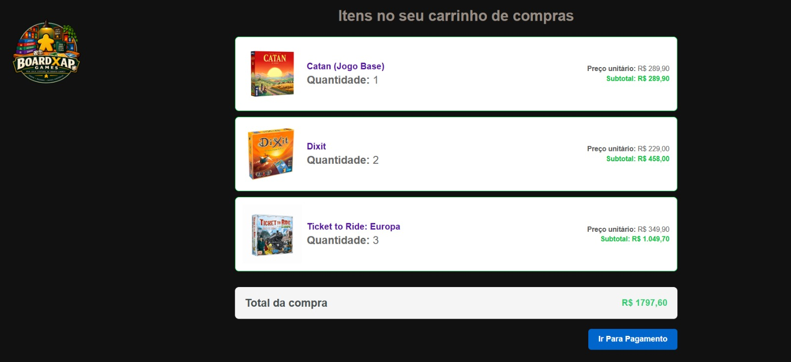
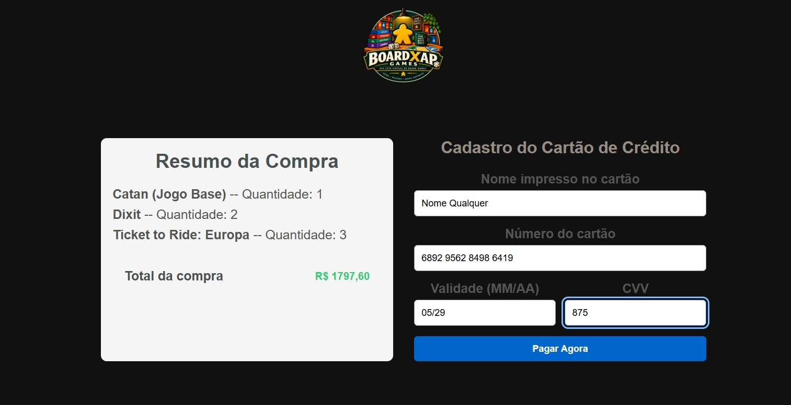
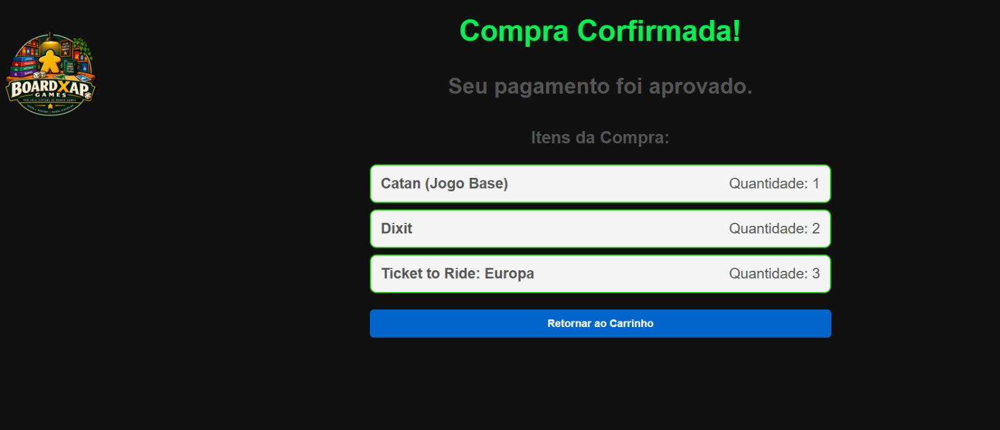
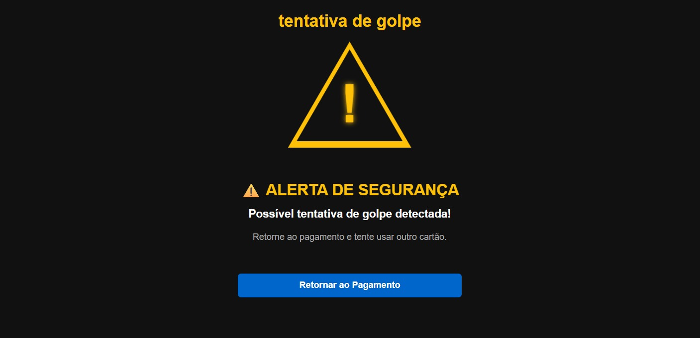
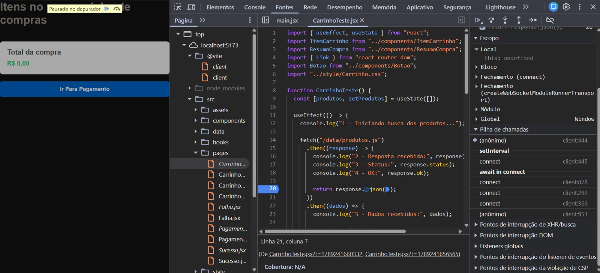
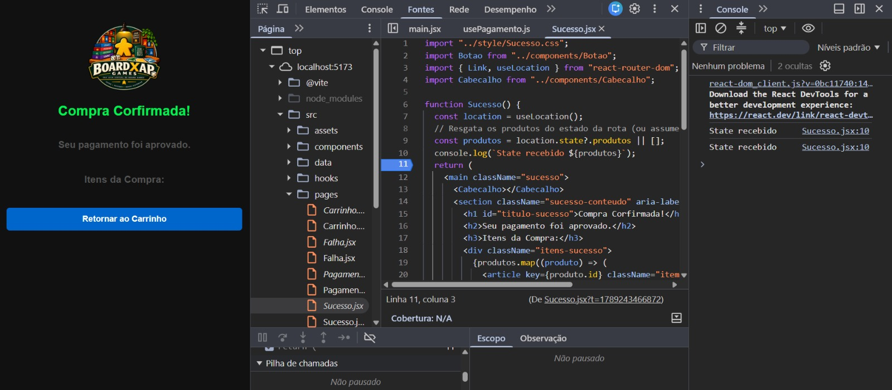
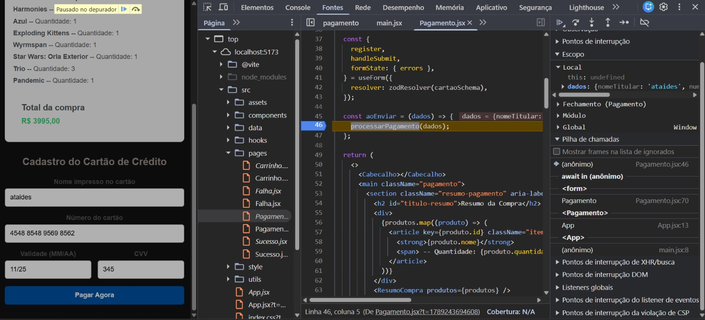

# Board Xap Games — Checkout React

Aplicação web de uma loja virtual fictícia de board games, desenvolvida em React.

O projeto simula o fluxo de finalização de uma compra no navegador, utilizando um carrinho de compras fixo, formulário de pagamento, validação dos dados fictícios do cartão e navegação entre as telas de sucesso e falha.

> **Observação:** não existe integração com banco de dados, back-end ou serviço de pagamento real. Toda a operação é uma simulação executada no navegador.

---

## Objetivo

Construir uma Single Page Application (SPA) em React que permita:

1. visualizar os produtos de um carrinho de compras fixo;
2. consultar quantidade, preço unitário, subtotais e total;
3. avançar para a tela de pagamento;
4. preencher dados fictícios de cartão;
5. validar os campos com React Hook Form e Zod;
6. simular o processamento assíncrono da compra;
7. encaminhar a compra para sucesso ou falha de acordo com a regra definida no projeto.

A regra principal da simulação é:

- cartão com **16 dígitos** e todos os dígitos iguais → compra recusada;
- qualquer outro cartão que atenda ao formato → compra aprovada.

Na tela de falha, a aplicação apresenta exatamente:

> `tentativa de golpe`

Seguido de um alerta de Possivel tentativa de golpe.

---

## Demonstração

### Fluxo da aplicação

```text
Carrinho
   │
   │ Ir para pagamento
   ▼
Pagamento
   │
   │ validação + processamento
   ▼
 ┌───────────────┐
 │               │
 ▼               ▼
Sucesso        Falha
 │               │
 ▼               ▼
Voltar ao      Tentar
Carrinho       novamente
```

## Imagens do projeto

### Carrinho



### Pagamento



### Compra aprovada



### Compra recusada



### Investigação com DevTools



## Tecnologias utilizadas

- React
- JavaScript
- JSX
- CSS
- Vite
- React Router
- React Hook Form
- Zod
- `@hookform/resolvers`
- Git e GitHub

As tecnologias utilizadas estão alinhadas aos requisitos técnicos do projeto, que solicita React, JavaScript/JSX, CSS, React Router, React Hook Form, Zod, custom hook, módulos ES e processamento assíncrono.

---

## Estrutura do projeto

A organização atual separa páginas, componentes, regras de negócio, dados e estilos:

```text
src/
├── components/
│   ├── AlertaGolpe.jsx
│   ├── Botao.jsx
│   ├── Cabecalho.jsx
│   ├── ItemCarrinho.jsx
│   └── ResumoCompra.jsx
│
├── data/
│   └── produtos.js
│
├── hooks/
│   └── usePagamento.js
│
├── pages/
│   ├── Carrinho.jsx
│   ├── Pagamento.jsx
│   ├── Sucesso.jsx
│   └── Falha.jsx
│
├── utils/
│   └── pagamento.js
│
├── main.jsx
├── App.jsx
└── index.css
```

Os estilos específicos ficam separados dos componentes/páginas:

```text
style/
├── AlertaGolpe.css
├── Botao.css
├── Cabecalho.css
├── Carrinho.css
├── Falha.css
├── ItemCarrinho.css
├── Pagamento.css
├── ResumoCompra.css
└── Sucesso.css
```

O `index.css` é utilizado para regras globais, como fonte, `box-sizing`, `body`, `#root`, foco visível e comportamento básico de elementos.

---

## Principais funcionalidades

### Carrinho

O carrinho utiliza um array local de objetos contendo:

```javascript
{
  (id, nome, preco, quantidade, img);
}
```

Os produtos são renderizados utilizando `map()` e `key` estável. Cada item apresenta nome, quantidade, imagem, preço unitário e subtotal.

O total é calculado a partir dos dados dos produtos utilizando `reduce()`.

### Pagamento

O formulário utiliza:

- React Hook Form;
- Zod;
- `zodResolver`;
- mensagens de erro;
- atributos de acessibilidade.

São validados:

- nome do titular;
- cartão com 16 dígitos;
- validade no formato `MM/AA`;
- mês entre `01` e `12`;
- CVV com 3 dígitos.

O campo do cartão aceita somente a digitação de números e exibe espaços automaticamente a cada quatro dígitos, mantendo a validação baseada nos 16 números.

### Regra do cartão

A regra de segurança foi isolada em:

```text
src/utils/pagamento.js
```

A função verifica se o mesmo dígito aparece 16 vezes:

```javascript
/^(\d){15}$/;
```

Se todos forem iguais, o resultado é recusado.

### Processamento assíncrono

O pagamento é simulado com uma `Promise` e `setTimeout`.

Durante o processamento:

- o botão de pagamento fica desabilitado;
- a interface informa que a compra está sendo processada;
- após a conclusão, a aplicação navega para a tela de sucesso ou falha.

Essa abordagem demonstra o uso de `Promise`, `async/await`, estado e navegação programática. A aplicação exibe `Processando compra…` e impede novos envios durante a espera, evitando assim a redundancia de envio do formulário.

### Sucesso

A tela confirma a aprovação e apresenta os itens da compra apenas com:

- nome;
- quantidade.

Os valores não são exibidos nessa tela.

### Falha

A tela apresenta:

```text
tentativa de golpe
```

e oferece a opção de retornar ao pagamento.

---

## Acessibilidade

Foram aplicadas algumas práticas de acessibilidade:

- `lang="pt-BR"` no documento;
- `<main>` e `<section>` para estrutura semântica;
- títulos associados às seções;
- `label` associado aos respectivos `input` por `htmlFor`/`id`;
- `aria-invalid` nos campos com erro;
- `aria-describedby` para relacionar os campos às mensagens;
- `role="alert"` nas mensagens de validação;
- `:focus-visible` para navegação por teclado;
- `autoComplete` apropriado para os dados do cartão;
- `inputMode="numeric"` nos campos numéricos.

Sendo consoliado o HTML semântico, os rótulos associados, o foco visível e feedback acessível.

---

## Responsividade

A aplicação utiliza CSS separado por página/componente e media queries para adaptar o layout.

Foram considerados principalmente:

- desktop;
- tablet;
- telas pequenas de celular.

Exemplo no pagamento: o layout de duas colunas passa para uma coluna em telas menores.

---

# Bugs encontrados e como foram corrigidos

Durante o desenvolvimento foram encontrados problemas importantes. Eles foram utilizados como parte do processo de aprendizagem e depuração.

## 1. Produtos carregados com `fetch()` de um arquivo `.js`

### Problema

Inicialmente foi utilizado:

```javascript
fetch("/data/produtos.js");
```

seguido da tentativa de interpretar a resposta como JSON.

O problema é que `produtos.js` é um módulo JavaScript, e não um arquivo JSON.

### Sintoma

A aplicação não carregava os produtos corretamente.

### Investigação

Foi analisado o fluxo de carregamento dos dados e identificado que o formato do arquivo não correspondia ao método utilizado para leitura.

### Solução

Como o projeto permite um array local em JavaScript, os produtos passaram a ser importados diretamente:

```javascript
import produtos from "../data/produtos";
```

Isso simplificou o código e evitou o uso desnecessário de `fetch`.

---

## 2. Produtos não apareciam na tela de sucesso

### Problema

A tela de sucesso utilizava:

```javascript
const produtos = location.state?.produtos || [];
```

Porém, em determinados momentos o estado recebido era:

```text
STATE RECEBIDO: null
```

Consequentemente:

```javascript
produtos;
```

assumia:

```javascript
[];
```

e o `map()` não renderizava nenhum item.

### Investigação

Foi utilizado o DevTools para acompanhar o estado recebido pela página.

Durante a investigação foram observados registros como:

```text
STATE RECEBIDO: null
PRODUTOS: []
```

e, depois da correção do fluxo:

```text
STATE RECEBIDO: { produtos: Array(...) }
PRODUTOS: [{...}, {...}, ...]
```

### Solução

O fluxo de navegação foi analisado no `usePagamento`, verificando o envio do estado pelo `navigate()`:

```javascript
navigate(`/sucesso/${respostaApi.id}`, {
  state: { produtos: produtos },
});
```

Assim, a página de sucesso consegue recuperar os produtos através do `useLocation()`.

### Evidência



---

## 3. Cartão com todos os dígitos iguais não navegava para a tela de falha

### Problema

A regra de segurança chegou a ser colocada dentro da validação do Zod.

Quando o cartão era:

```text
1111 1111 1111 1111
```

o Zod retornava um erro de validação.

Isso fazia com que o `handleSubmit()` impedisse a execução da função responsável pelo processamento.

### Sintoma

A mensagem aparecia no formulário, mas a aplicação não navegava para `/falha`.

### Investigação

O fluxo foi acompanhado para descobrir por que `aoEnviar()` não era executado.

Foi identificado que a regra de "todos os dígitos iguais" não deveria ser tratada como erro de formato do formulário.

### Solução

A validação de formato permaneceu no Zod, enquanto a regra de negócio passou para:

```text
src/utils/pagamento.js
```

e foi chamada pelo:

```text
src/hooks/usePagamento.js
```

Dessa forma:

```text
Formato inválido
      ↓
Zod
      ↓
permanece no formulário

Formato válido
      ↓
processamento
      ↓
todos os dígitos iguais?
   ↙           ↘
 SIM           NÃO
  ↓             ↓
Falha         Sucesso
```

Essa separação também respeita o requisito de que números válidos com todos os dígitos iguais devem chegar à tela de falha, e não apenas produzir um erro de campo.

---

# Processo de depuração com DevTools

A depuração foi utilizada para investigar comportamentos reais da aplicação, principalmente no fluxo de pagamento e na passagem de dados entre rotas.

Um dos principais casos investigados foi:

```text
Pagamento
   ↓
usePagamento
   ↓
navigate()
   ↓
Sucesso
   ↓
useLocation()
```

O comportamento inesperado era:

```text
STATE RECEBIDO: null
```

O estado foi acompanhado durante a execução até identificar onde os produtos deixavam de estar disponíveis.

### Como reproduzir a investigação

1. Abrir o DevTools do navegador.
2. Acessar a tela de pagamento.
3. Preencher os dados fictícios.
4. Colocar breakpoint no fluxo de `processarPagamento`.
5. Executar o pagamento.
6. Acompanhar os dados antes do `navigate()`.
7. Verificar o estado recebido na página de sucesso.
8. Comparar o comportamento antes e depois da correção.

### Evidência visual



---

# Casos de teste

## Carrinho

| Teste          | Resultado esperado                |
| -------------- | --------------------------------- |
| Abrir `/`      | Exibir produtos                   |
| Ver quantidade | Exibir quantidade de cada produto |
| Ver preços     | Exibir preço unitário e subtotal  |
| Ver total      | Exibir total calculado            |

## Pagamento

| Entrada                             | Resultado                        |
| ----------------------------------- | -------------------------------- |
| Titular vazio                       | Erro                             |
| Titular com números                 | Erro/filtro de entrada           |
| Cartão incompleto                   | Erro                             |
| Cartão com 16 dígitos               | Aceito                           |
| Validade `00/29`                    | Erro                             |
| Validade `13/29`                    | Erro                             |
| Validade `12/29`                    | Aceita                           |
| CVV com 2 dígitos                   | Erro                             |
| CVV com 3 dígitos                   | Aceito                           |
| `1111111111111111`                  | Falha                            |
| `1234567890123456`                  | Sucesso                          |
| Cartão digitado com espaços visuais | Validação baseada nos 16 dígitos |

---

# Como executar

## Pré-requisitos

Ter instalado:

- Node.js
- npm

## Instalação

Clone o repositório:

```bash
git clone URL_DO_REPOSITORIO
```

Entre na pasta:

```bash
cd NOME_DO_PROJETO
```

Instale as dependências:

```bash
npm install
```

Execute o projeto:

```bash
npm run dev
```

Depois, abra o endereço informado pelo Vite no navegador.

> Substituir `URL_DO_REPOSITORIO` e `NOME_DO_PROJETO` pelos dados reais antes da entrega.

---

# Rotas

| Rota                 | Página             |
| -------------------- | ------------------ |
| `/`                  | Carrinho           |
| `/pagamento`         | Pagamento          |
| `/sucesso/:pedidoId` | Compra aprovada    |
| `/falha/:pedidoId`   | Tentativa de golpe |

A aplicação utiliza React Router e navegação programática após a simulação do pagamento.

---

# Git e organização do desenvolvimento

O projeto foi desenvolvido utilizando Git para controle de versão.

Estruturas das branches no projeto:

```text
main
  │
  └── develop
       │
       ├── feature/rotas
       ├── feature/produtos
       ├── feature/componentes
       ├── feature/formulario
       ├── feature/sucesso
       ├── feature/pageFalha
       ├── fix/mostrarValorTotal
       ├── feature/acessibilidade
       ├── feature/imagens
       └── feature/logo
```

---

# Trello

Quadro utilizado para organizar as tarefas do projeto:

**[https://trello.com/invite/b/6a0c535be9cba71e3001df0b/ATTIbcf4b12e59a7551f379ef5278db2d9e922AE29EA/projeto-carrinho-de-compras]**

---

# Uso de IA

A IA foi utilizada como ferramenta de apoio durante o desenvolvimento, principalmente para:

- explicar conceitos do React;
- analisar erros;
- sugerir melhorias de acessibilidade;
- revisar responsividade;
- auxiliar na investigação de bugs;
- discutir organização dos componentes e CSS.

As sugestões foram revisadas, testadas e adaptadas ao projeto.

Um dos principais objetivos durante o desenvolvimento foi compreender o código e conseguir explicar as decisões tomadas, em vez de apenas copiar soluções prontas.

---

# Melhorias futuras

Algumas melhorias que poderiam ser implementadas em uma versão futura:

- permitir alteração da quantidade dos produtos;
- permitir remoção de itens do carrinho;
- adicionar catálogo de produtos;
- adicionar imagens individuais aos produtos;
- criar uma página de detalhes do produto;
- criar testes automatizados;
- melhorar feedback visual durante o processamento;
- adicionar uma tela de carregamento mais elaborada;
- utilizar dados vindos de uma API real, caso o escopo permita;
- melhorar a experiência de navegação por teclado;
- adicionar testes de acessibilidade com Lighthouse.

Essas funcionalidades são futuras evoluções que deixariam o projeto mais completo.

---
